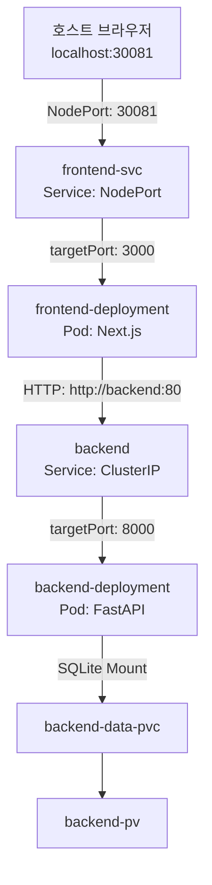

# Team Todo Board

팀 협업을 위한 투두 보드 서비스입니다.

---

## 1. 기술 스택

- **Frontend**: Next.js (App Router), TailwindCSS, Playwright
- **Backend**: FastAPI, SQLite
- **Infrastructure**: Docker, Kubernetes, GitHub Actions (Self-Hosted Runner)

---

## 2. 주요 기능

1. **실시간 상태 동기화**: 투두 추가, 수정, 삭제 및 완료 상태 변경 사항이 실시간으로 데이터베이스에 반영되어 모든 사용자가 동기화된 화면을 조회합니다.
2. **주간 캘린더 네비게이션**: 주간 날짜별 일정 및 해당 날짜에 등록된 투두 개수를 조회할 수 있습니다.
3. **상태별 필터링**: 전체, 진행 중, 완료 탭을 통해 상태에 맞는 투두 항목을 필터링하여 조회할 수 있습니다.

---

## 3. 프로젝트 구조

```text
├── .github/workflows/deploy.yml   # CI/CD 파이프라인 구성 파일
├── backend/                       # FastAPI 애플리케이션 및 Dockerfile
├── frontend/                      # Next.js 애플리케이션 및 Dockerfile
│   └── tests/todo.spec.ts         # Playwright E2E 테스트 코드
├── k8s/                           # Kubernetes 매니페스트 파일
│   ├── backend-deployment.yaml    # 백엔드 Deployment
│   ├── backend-pv.yaml            # Local HostPath PersistentVolume
│   ├── backend-pvc.yaml           # PersistentVolumeClaim
│   ├── backend-service.yaml       # 백엔드 Service (ClusterIP)
│   ├── frontend-deployment.yaml   # 프론트엔드 Deployment
│   └── frontend-service.yaml      # 프론트엔드 Service (NodePort)
├── docker-compose.yml             # 로컬 개발 환경 정의
└── docker-compose.test.yml        # E2E 테스트 구동 환경 정의
```

---

## 4. 네트워크 및 포트 설계

### 서비스 매핑 흐름


### 포트 상세 명세

| 서비스명 | 리소스 타입 | 내부 포트 (Service Port) | 컨테이너 포트 (Target Port) | 노드 노출 포트 (NodePort) | 비고 |
| :--- | :--- | :--- | :--- | :--- | :--- |
| **frontend-svc** | `NodePort` | `80/TCP` | `3000/TCP` | `30081` | 브라우저 접근 주소: `http://localhost:30081` |
| **backend** | `ClusterIP` | `80/TCP` | `8000/TCP` | - | 프론트엔드 컨테이너 내부 호출 전용 (`http://backend:80`) |

---

## 5. 인프라 실행 및 제어

각 환경별 구동 및 종료 명령어 요약입니다.

### 환경별 CLI 명령어 요약

| 대상 환경 | 동작 | 실행 명령어 | 비고 |
| :--- | :--- | :--- | :--- |
| **로컬 개발 환경** (Docker Compose) | 기동 | `docker-compose up -d --build` | 프론트엔드: `localhost:3000` <br> 백엔드: `localhost:8000` |
| | 종료 | `docker-compose down -v` | 컨테이너 중지 및 볼륨 데이터 초기화 |
| **E2E 테스트** (Playwright) | 실행 | `docker-compose -f docker-compose.test.yml up --build -d backend-test frontend-test && docker-compose -f docker-compose.test.yml run --rm playwright` | 테스트 서버 기동 및 자동 테스트 일괄 실행 |
| | 정리 | `docker-compose -f docker-compose.test.yml down -v` | 테스트 격리 환경 리소스 일괄 정리 |
| **Kubernetes 환경** (Local/Prod) | 기동 | `.\deploy-local.ps1` | 로컬 볼륨 폴더 생성, 도커 빌드, k8s 매니페스트 배포 일괄 처리 |
| | 종료 | `.\clean-local.ps1` | k8s 매니페스트 기반 리소스 일괄 삭제 |

---

## 6. CI/CD 파이프라인 (GitHub Actions)

`main` 브랜치 변경 사항 Push 시, 다음 순서로 파이프라인이 자동 실행됩니다:

1. **Lint & Build**: 프론트엔드/백엔드 빌드 검증 및 코드 컨벤션 체크
2. **E2E Test**: 격리 환경(`docker-compose.test.yml`) 구축 후 Playwright 테스트 검증
3. **Registry Push**: 운영 이미지 빌드 및 Docker Hub 저장소 업로드 (`for-k8s` 태그)
4. **Kubernetes Deploy**: 실서버 노드에서 deployment 롤링 업데이트 실행 (`kubectl rollout restart`)
